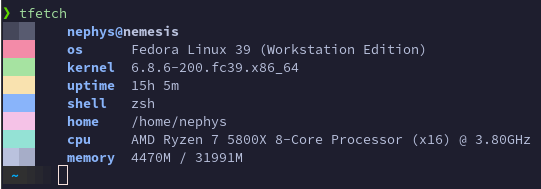

# t(urbo)fetch
A quick and dirty fetch utility, designed to be lightweight and fast.
It doesn't come with all the bells and whistles other fetch utilities may have but it gets the job done and doesn't take 2-3 business days to display anything.

___

# Building
All you need is CMake and a C compiler.
Run the build.sh script and enjoy.

## Installing
If you want to install tfetch just run the install.sh script instead.

## debug.sh
debug.sh should only be used if you plan on forking tfetch and make it your own, all you need it valgrind installed in order to check for memory leaks.
